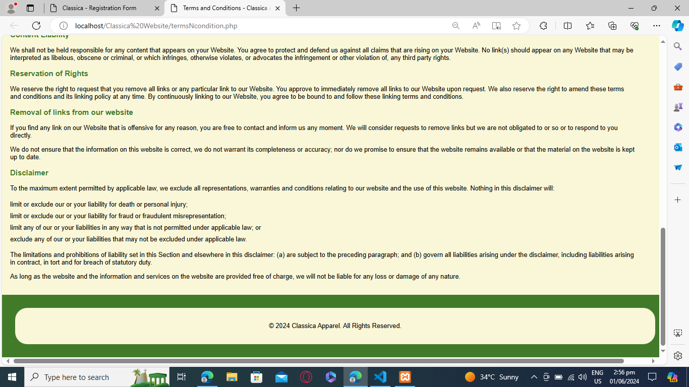

# Classica Website

Final Project in Application and Emerging Technologies.

## About
This is a simple e-commerce website platform for imaginary clothing company named Classica.

## Features
- Sign up and Login
- Admin
  - Add Product
  - Delete Product
  - Update Product
- User
  - Add Order
  - Update Order
  - Remove/Clear Order

### Login Page

### Signup Page

### Terms and Condition Page

### Admin Page

### User View Product Page

### User Cart Page

### Checkout

## Requirements

- XAMPP

## Account
**Username:** Admin 

**Password:** adminpassword

## Setup
1. Download and Copy/Cut the "Classica Website" folder to "xampp/htdocs" file directory.
2. Start the Apache and MySQL in XAMPP Control Panel.
3. Click the MySQL admin button.
4. Create new database with a name "shop_db".
5. Import the "shop_db.sql" file from "Classica Website/database" file directory to the new database.
